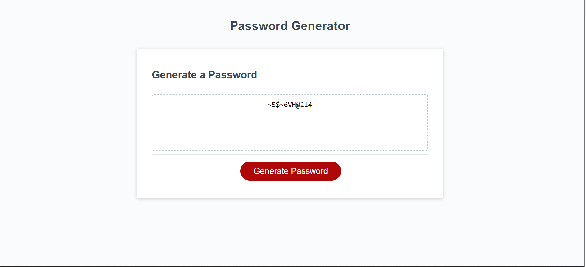

# random-password-generator

## Description

In this project we made a password generator to generate a random password that met certain requirements for greater security.

### Tasks Completed

To complete task we added multiple prompts to generate random password to include 8-128 characters, lowercase characters, uppercase characters, numbers, and also special characters. The password is randomly generated after completing all promts.

### Links

Github URL - https://github.com/natesanow/random-password-generator

Live URL - https://natesanow.github.io/random-password-generator/

### Screenshot

